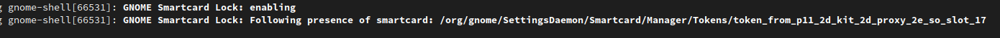

# Smartcard Lock for GNOME

This is a GNOME Shell Extention that looks for smartcards, and immediately locks the screen if one of them is removed using **org.gnome.SettingsDaemon.Smartcard.Token** interface.

Action shot: https://youtu.be/iagRs7pNGko

Since there is no GUI, I can't provide a screenshot! :)

But there's a screenshot of a development release in debug mode which does provide some logging:

## Future
- maybe specify which smartcards to look at

## Special thanks:

- [Andy Holmes](https://github.com/andyholmes) for very helpful hints and written documentation that allowed someone like me (with pratically zero JavaScript experience) to write a GNOME Shell Extension.

## License

Smartcard Lock for GNOME is licensed under the terms of the GNU GPL 3.0 or, at your option, any later version. Please read the complete terms under LICENSE.

## FAQ and Known Issues

There's a wiki page for [FAQ's and Known Issues](https://github.com/rseabra/smartcard-lock/wiki/FAQ), please check it out before opening an issue.
